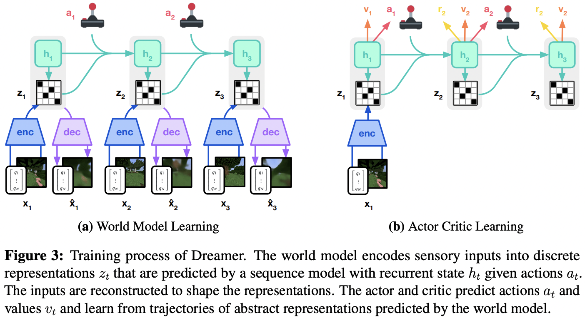

</img>

## DreamerV3 - Pytorch (wip)

Implementation of [DreamerV3](https://danijar.com/project/dreamerv3/) in Pytorch

## Citation

```bibtex
@article{Hafner2023MasteringDD,
    title   = {Mastering Diverse Domains through World Models},
    author  = {Danijar Hafner and J. Pa{\vs}ukonis and Jimmy Ba and Timothy P. Lillicrap},
    journal = {ArXiv},
    year    = {2023},
    volume  = {abs/2301.04104},
    url     = {https://api.semanticscholar.org/CorpusID: 255569874}
}
```
